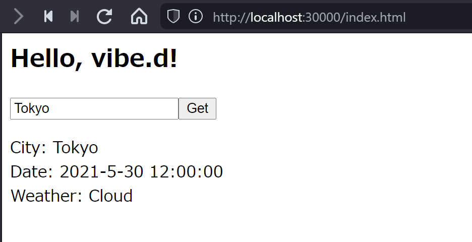
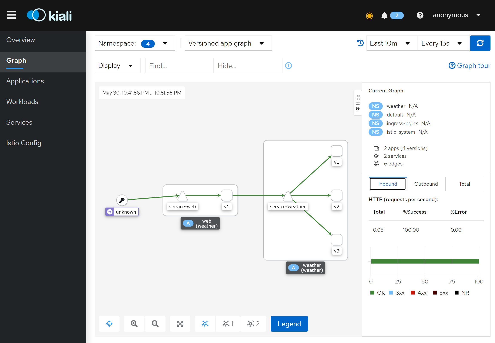
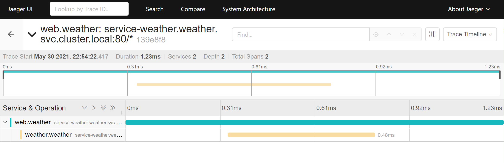

# Example of Distributed Tracing

# What's this?

- Containerized vibe.d web app with multi-stage build
- Example implementation to support distributed tracing of service meshes

# Tracing images

__App__



__App Graph__



__Trace__



# Requirements

- Kubernetes
- Istio(`istioctl`)

## Setup Istio

__Download `istioctl`__

- [Release page](https://github.com/istio/istio/releases)

__Install Istio__

```console
istioctl install --set profile=demo --skip-confirmation
istioctl verify-install
```

__Install addons__

```console
kubectl apply -f https://raw.githubusercontent.com/istio/istio/release-1.10/samples/addons/prometheus.yaml
kubectl apply -f https://raw.githubusercontent.com/istio/istio/release-1.10/samples/addons/jaeger.yaml
kubectl apply -f https://raw.githubusercontent.com/istio/istio/release-1.10/samples/addons/kiali.yaml
kubectl apply -f https://raw.githubusercontent.com/istio/istio/release-1.10/samples/addons/grafana.yaml
kubectl apply -f https://raw.githubusercontent.com/istio/istio/release-1.10/samples/addons/extras/zipkin.yaml
```

# Build images

__Services__

```
docker build -t weather-service:v1 ./services/weather
docker build -t weather-service:v2 --build-arg BUILD_CONFIG=VERSION_2 ./services/weather
docker build -t weather-service:v3 --build-arg BUILD_CONFIG=VERSION_3 ./services/weather
```

__Web__

```
docker build -t web:v1 ./web
```

# Run

```console
kubectl create namespace weather
kubectl label namespace weather istio-injection=enabled
kubectl apply -n weather -f example.yaml
```

1. Access to __http://localhost:30000__
2. Search some location (allow any text)


# Show Dashboard

```console
istioctl dashboard kiali
istioctl dashboard jaeger
istioctl dashboard grafana
```

# References

- https://github.com/istio/istio/tree/master/samples/bookinfo
